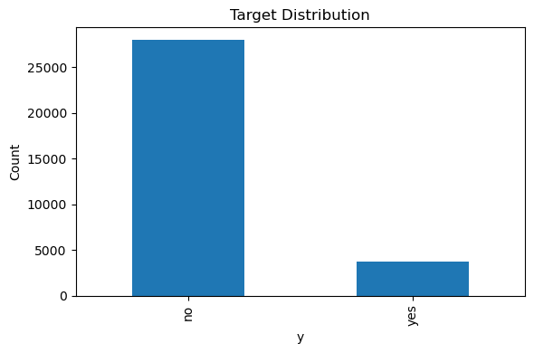
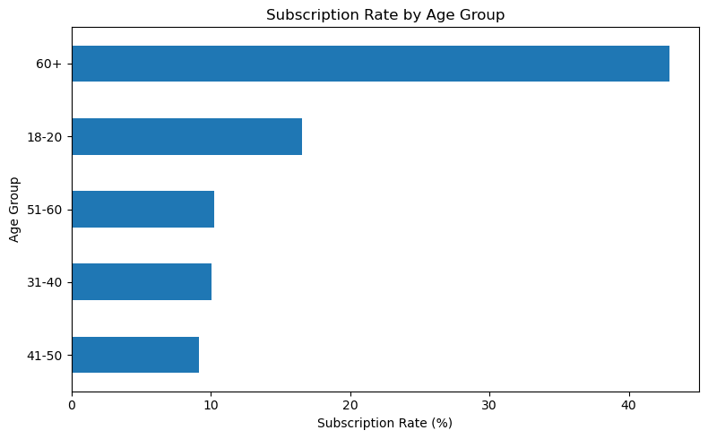
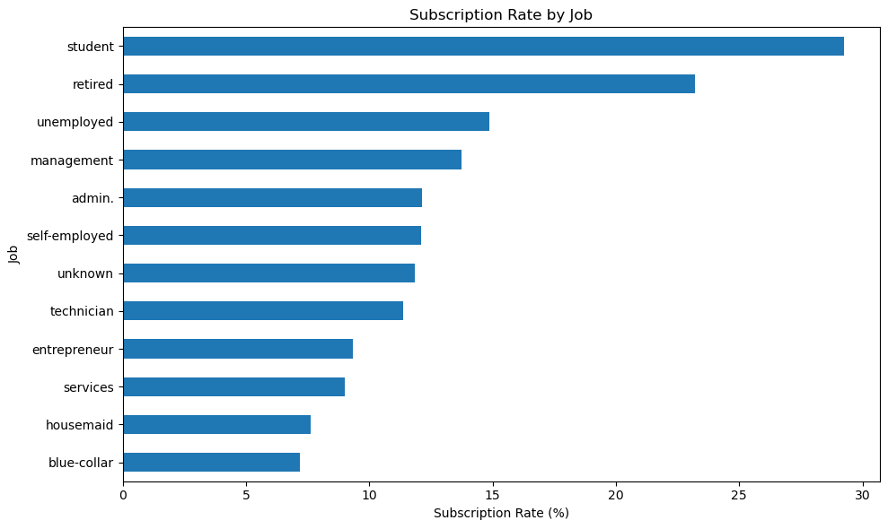
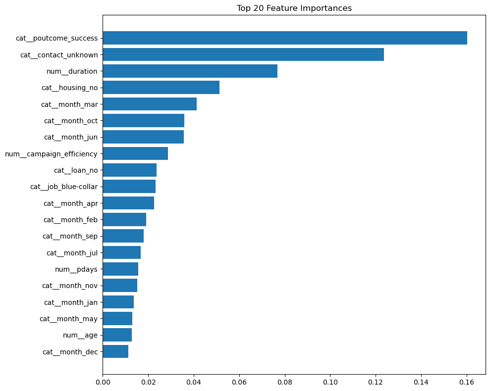
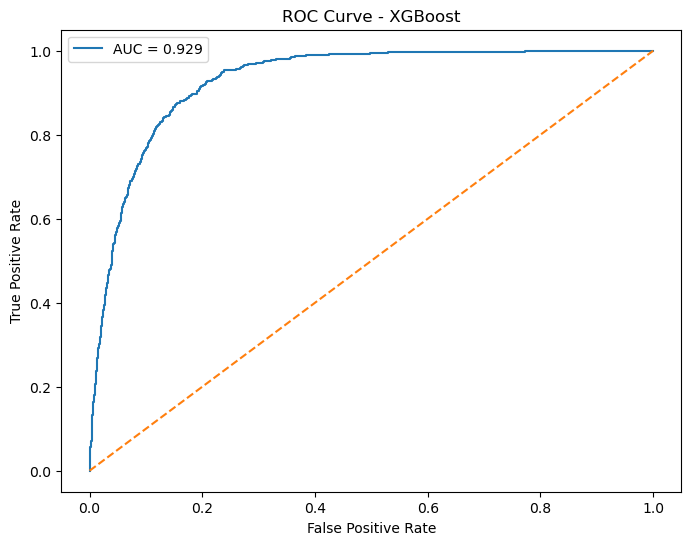

# Bank Marketing Subscription Prediction using Machine Learning

## Project Overview

This project develops an end-to-end machine learning pipeline to predict whether a customer will subscribe to a term deposit based on demographic information, financial attributes, previous marketing interactions, and campaign characteristics.

The objective is to help marketing teams identify high-probability customers, improve campaign targeting efficiency, and reduce customer acquisition costs.

---

## Business Problem

Direct marketing campaigns often contact thousands of customers with low conversion rates. Predicting which customers are most likely to subscribe enables:

* Improved marketing ROI
* Better customer targeting
* Reduced campaign costs
* Increased conversion rates
* Data-driven decision making

---

## Dataset

**Source:** UCI Bank Marketing Dataset

The dataset contains customer demographic information, banking attributes, and historical campaign interaction data.

### Target Variable

| Variable | Description                                                |
| -------- | ---------------------------------------------------------- |
| y        | Whether the customer subscribed to a term deposit (Yes/No) |

### Dataset Characteristics

* Class Imbalance:

  * No: ~88%
  * Yes: ~12%
* Mixed numerical and categorical features
* Real-world marketing campaign data
* Suitable for binary classification

---

## Project Structure

```text
bank_data_analysis/
│
├── data/
│
├── models/
│   └── xgboost_subscription_model.pkl
│
├── notebooks/
│   └── bank_marketing_analysis.ipynb
│
├── src/
│   ├── preprocess.py
│   ├── train.py
│   ├── evaluate.py
│   └── predict.py
│
├── outputs/
│   └── figures/
│       ├── target_distribution.png
│       ├── age_group_conversion.png
│       ├── job_conversion.png
│       ├── feature_importance.png
│       └── roc_curve.png
│
└── README.md
```

---

## Exploratory Data Analysis

Key analyses performed:

* Target class distribution
* Age group conversion analysis
* Job category conversion analysis
* Contact method effectiveness
* Campaign performance analysis
* Feature relationship exploration

### Key Insights

#### Age Groups

Customers aged 60+ showed the highest subscription rate.

| Age Group | Subscription Rate |
| --------- | ----------------- |
| 60+       | 42.9%             |
| 18-30     | 16.5%             |
| 51-60     | 10.2%             |
| 31-40     | 10.1%             |
| 41-50     | 9.2%              |

#### Occupation Analysis

Top converting occupations:

| Job        | Subscription Rate |
| ---------- | ----------------- |
| Student    | 29.2%             |
| Retired    | 23.2%             |
| Unemployed | 14.9%             |

Lowest conversion:

| Job         | Subscription Rate |
| ----------- | ----------------- |
| Blue-collar | 7.2%              |

#### Contact Method Analysis

| Contact Type | Subscription Rate |
| ------------ | ----------------- |
| Cellular     | 15.0%             |
| Telephone    | 13.4%             |
| Unknown      | 4.1%              |

Cellular contact channels significantly outperformed unknown contacts.

---

## Feature Engineering

Custom features were created to improve predictive performance:

### Age Group

Customer age segmented into business-relevant categories.

### Balance Group

Customer account balance categorized into:

* Low
* Medium
* High
* Very High

### Contact Intensity

```python
campaign + previous
```

Measures total marketing interactions.

### Campaign Efficiency

```python
duration / (campaign + 1)
```

Measures call effectiveness relative to campaign attempts.

---

## Machine Learning Pipeline

A fully automated Scikit-learn pipeline was developed consisting of:

### Preprocessing

* StandardScaler for numerical variables
* OneHotEncoder for categorical variables
* Automated feature engineering

### Model

XGBoost Classifier

Parameters:

```python
XGBClassifier(
    n_estimators=200,
    learning_rate=0.05,
    max_depth=5,
    random_state=42,
    eval_metric='logloss'
)
```

---

## Model Performance

### Classification Metrics

| Metric    | Value |
| --------- | ----- |
| Accuracy  | 91%   |
| Precision | 65%   |
| Recall    | 46%   |
| F1 Score  | 54%   |

### Advanced Evaluation Metrics

| Metric       | Value |
| ------------ | ----- |
| ROC-AUC      | 0.929 |
| KS Statistic | 72.05 |

### Interpretation

* ROC-AUC of 0.929 indicates excellent customer ranking capability.
* KS Statistic of 72.05 demonstrates strong separation between subscribers and non-subscribers.
* The model effectively identifies high-probability customers for targeted marketing campaigns.

---

## Feature Importance

Top predictive factors included:

* Previous campaign outcome success
* Contact method
* Call duration
* Housing loan status
* Month of contact
* Campaign efficiency
* Customer age

---

## Prediction Pipeline

The project supports prediction on new customer records using:

```bash
python src/predict.py
```

Example Output:

```text
Prediction: 1
Subscription Probability: 55.95%
```

---

## Visualizations

### Target Distribution



### Age Group Conversion Rate



### Job Conversion Rate



### Feature Importance



### ROC Curve



---

## Technologies Used

* Python
* Pandas
* NumPy
* Matplotlib
* Scikit-learn
* XGBoost
* Joblib
* Jupyter Notebook

---

## Future Improvements

* Hyperparameter optimization using Optuna
* Threshold tuning for recall improvement
* SHAP explainability analysis
* Model deployment with FastAPI
* Automated retraining pipeline
* Customer propensity dashboard using Power BI or Tableau

---

## Author

Narmathaa Palanisamy

Aspiring Data Scientist with a background in Biotechnology, Stem Cell Biology, Machine Learning, and Biomarker Discovery.

Interested in applying AI and Machine Learning to healthcare, biotechnology, neuroscience, and business analytics.
